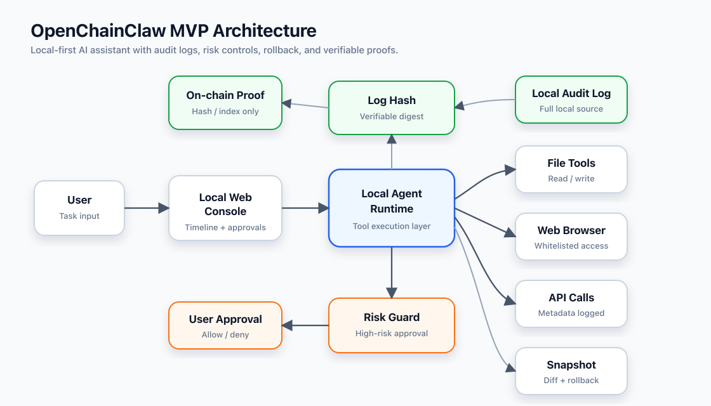

# OpenChainClaw

**语言：**[English](README.md) | 简体中文

OpenChainClaw 是一个本地优先、可验证、可回溯的个人智能助手原型。项目重点不是先追求更强的自动执行能力，而是验证一个更基础的问题：用户是否愿意因为操作过程透明、风险可拦截、记录可验证而选择使用这个助手。

## 项目定位

- 本地网页控制台用于创建任务、查看时间线、处理风险确认和阅读审计报告。
- 本地运行时负责文件读写、网页访问、接口调用、风险判断、快照、回滚和本地证明记录。
- 原始日志默认只保存在本地。
- 可验证记录只保存哈希、索引、时间戳和风险摘要，不保存原始隐私数据。
- 钱包能力是可选增强，不是使用门槛。

## 当前状态

当前仓库处于 `V0.1` 本地原型阶段，已经具备本地控制台、确定性演示运行时、TypeScript/ESM Node 运行时，以及可选的服务端 PostHog 事件采集。

已完成能力包括：

- 从本地控制台创建任务；
- 记录文件读取、文件修改、风险判断、用户确认、网页访问、接口调用和本地证明事件；
- 默认阻止隐藏文件和敏感文件读取；
- 非白名单网页访问前进入高风险确认；
- 文件修改前创建快照；
- 展示文件差异并支持回滚；
- 生成确定性本地审计哈希；
- 写入本地可验证账本记录。

下一阶段探索方向包括：

- 真实模型规划和执行循环；
- 真实网页自动化和网页内容提取；
- 真实外部接口调用；
- 通过可信即时通讯渠道在手机上控制本地智能助手；
- 可选钱包连接和钱包签名确认；
- 可验证证明提交。

## 架构



架构图源文件：

- [Mermaid](docs/architecture.mmd)
- [SVG](docs/assets/architecture.svg)

## 快速开始

运行要求：

- `Node.js 22.22.0` 或更新版本；
- `pnpm 10.x`。

```bash
pnpm install
pnpm typecheck
pnpm test
pnpm start
```

启动后访问：

```text
http://127.0.0.1:4173
```

本地审计数据会写入 `.openchainclaw/`，演示工作区会写入 `data/workspace/`。这两个目录都不会进入版本库。

## 可选 PostHog Analytics

服务端 analytics 默认关闭。如需启用，在启动本地控制台前设置环境变量：

```bash
POSTHOG_PROJECT_API_KEY=phc_xxx POSTHOG_HOST=https://us.i.posthog.com pnpm start
```

`pnpm start` 会在 `.env` 存在时自动读取它。你可以复制 `.env.example`，并设置 `POSTHOG_PROJECT_API_KEY` 或 `POSTHOG_PROJECT_TOKEN`。

当前采集的事件包括演示任务创建、演示任务启动、高风险操作批准或拒绝、文件回滚完成，以及服务端异常。事件属性只包含 ID、状态、数量和安全元数据；不会发送原始提示词、文件内容、接口请求正文、令牌、私钥或浏览器身份凭据。

## 原型演示流程

运行本地控制台后，可以用默认任务体验当前原型：

1. 创建一个演示任务；
2. 查看任务时间线中的文件读取、文件修改、风险判断和证明事件；
3. 在非白名单网页访问前批准或拒绝高风险操作；
4. 查看文件修改差异；
5. 执行文件回滚；
6. 查看任务完成后的本地审计哈希和本地账本记录。

这个流程用于验证透明审计、风险拦截、快照、回滚和本地证明，不代表已经接入真实模型、真实网页自动化或公链提交。

## 安全默认值

- 原始审计日志默认只保存在本机。
- 隐藏文件和疑似敏感文件默认禁止读取。
- 非白名单网页访问会先进入高风险确认。
- 文件修改前必须创建快照。
- 回滚操作本身也会进入审计记录。
- 可验证记录只保存哈希、索引、时间戳和风险摘要。
- 原始文件内容、接口请求正文、令牌、私钥和浏览器身份凭据不上链。

## 项目路线图

| 阶段 | 状态 | 公开目标 |
| --- | --- | --- |
| `V0.1` 本地原型 | 已完成 | 验证任务时间线、风险拦截、文件快照、回滚和本地账本证明。 |
| `V0.2` 最小可用内核 | 下一阶段 | 接入真实最小智能助手循环、可信启动向导、授权目录、网站白名单、偏好管理、网页访问和接口调用适配器。 |
| `V0.3` 可验证证明闭环 | 计划中 | 完成证明队列、可选钱包连接、签名摘要和本地记录对比。 |
| `V0.4` 早期试用版本 | 计划中 | 打磨任务历史、审计检索、报告导出、早期试用流程，以及通过可信即时通讯渠道进行手机端控制的实验。 |
| `V1.0` 最小可用产品 | 目标版本 | 让个人用户完成文件、网页、接口和手机端发起的任务，并能验证关键操作过程。 |

## 未来扩展方向

OpenChainClaw 会先打磨本地控制台和小型可信运行时。审计模型成熟后，未来版本可以逐步扩展到：

- 通过 Telegram、Signal、Discord、Slack 或其他用户批准的即时通讯渠道在手机上控制本地智能助手；
- 可信启动向导，帮助用户更安全地完成首次配置；
- 面向开发者工作流和个人知识库的更多工具连接器；
- 更丰富的证明后端和验证查看体验；
- 在本地控制台体验稳定后，再考虑可选伴侣应用。

这些扩展仍应遵循同一组安全默认值：日志本地优先、高风险操作显式确认、文件修改可恢复、原始隐私数据不上链。

## 许可证

[MIT](LICENSE)
